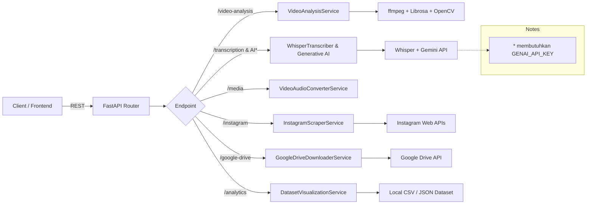

## Backend Video Analyzer Service

Backend ini dibangun dengan FastAPI dan menyediakan sekumpulan layanan otomasi untuk pipeline analitik konten video:

- **Instagram downloader & scraper**: ambil metadata, komentar, dan unduhan video.
- **Google Drive fetcher**: unduh file dan metadata dari URL berbagi Drive.
- **Media tools**: konversi video ke audio, transkripsi Whisper, ringkasan AI, chaptering, wordcloud.
- **Video analytics**: ekstraksi metrik visual/audio, generate grafik Plotly siap-embed.
- **Dataset utilities**: skrip CLI untuk memproses dan mem-visualisasikan dataset CSV yang disediakan panitia.



### Struktur Direktori

```
backend/
├── app/                     # Modul FastAPI, service layer, schemas, dependencies
├── downloads/               # Direktori hasil unduhan dan artefak analisis (dibuat otomatis)
├── process_dataset.py       # Skrip CLI untuk memproses dataset CSV -> JSON/visual
├── docker-compose.yml       # Stack Docker untuk development
├── Dockerfile               # Image API
├── requirements.txt         # Dependensi Python
└── README.md                # Dokumen ini
```

## Menjalankan dengan Python (tanpa Docker)

### Prasyarat
- Python 3.10 atau lebih baru.
- `ffmpeg` (wajib untuk konversi audio/video).
- (Opsional) GPU + CUDA bila ingin inference Whisper lebih cepat.

Install ffmpeg (contoh Ubuntu/Debian):

```bash
sudo apt update && sudo apt install -y ffmpeg
```

### Setup Lingkungan

1. Masuk ke direktori backend:
   ```bash
   cd backend
   ```
2. Buat virtualenv dan aktifkan:
   ```bash
   python -m venv .venv
   source .venv/bin/activate  # Windows: .venv\Scripts\activate
   ```
3. Instal dependensi:
   ```bash
   pip install --upgrade pip
   pip install -r requirements.txt
   ```
4. Konfigurasi variabel lingkungan:
   - Salin `.env` → `.env.local` bila ingin menyimpan konfigurasi pribadi.
   - Perbarui nilai penting:
     - `GENAI_API_KEY` → API key Google Gemini (opsional kecuali memakai endpoint ringkasan/chapter AI).
     - `INSTAGRAM_COOKIES_PATH` → path cookies (export dari browser) jika scraping login-only.
     - `WHISPER_MODEL`, `WHISPER_DEVICE` → atur model & device yang tersedia.

### Menjalankan Server

```bash
uvicorn app.main:app --host 0.0.0.0 --port 8000 --reload
```

Dokumentasi interaktif tersedia di `http://localhost:8000/docs`.

## Menjalankan dengan Docker Compose

1. Pastikan Docker & Docker Compose terinstal.
2. Dari folder `backend/`, bangun dan jalankan:

   ```bash
   docker compose up --build
   ```

   - Volume `./downloads` ter-mount agar hasil unduhan tetap tersimpan di host.
   - File `.env` otomatis dimuat ke container. Jangan commit nilai rahasia.
   - Server tersedia di `http://localhost:8000`.

Hentikan dengan `docker compose down`.

## Ringkasan Endpoint Utama

- `POST /instagram/scrape` – metadata + komentar tanpa mengunduh video.
- `POST /instagram/download` – metadata lengkap + unduhan video lokal.
- `POST /google-drive/download` – unduh file publik Drive.
- `POST /media/video-to-audio` – konversi MP4 → MP3.
- `POST /transcription/whisper` – transkripsi audio/video dengan Whisper.
- `POST /summary/transcript` – ringkasan teks berbasis Gemini (butuh API key).
- `POST /wordcloud/generate` – wordcloud dari transkrip.
- `POST /chapters/generate` – bagi transkrip ke chapter.
- `POST /video-analysis/visual` – metrik kecerahan, entropi, flicker, dsb.
- `POST /video-analysis/audio` – pitch tracking, spectral centroid, spectrogram.
- `POST /video-analysis/full` – gabungan visual + audio + ringkasan siap-embed.
- `GET /analytics/dataset/overview` – statistik dataset CSV.
- `GET /analytics/dataset/table` – data tabular siap render.
- `GET /analytics/dataset/pie` – breakdown kategori.

Lihat `app/models.py` dan `app/services/` untuk detail schema respons & logika bisnis.

## Skrip CLI Dataset

| Skrip | Deskripsi | Contoh Penggunaan |
| --- | --- | --- |
| `process_dataset.py` | Mengunduh video (opsional), mengekstrak audio, dan menyusun dataset bersih. | `python process_dataset.py --input "Data Problem Kedua.csv" --output-dir dataset --resume` |
| `csv_to_json.py` | Konversi CSV → JSON untuk konsumsi frontend. | `python csv_to_json.py Data\ Problem\ Kedua.csv final_dataset.json` |
| `download-data.py` | Bulk download media dari daftar URL. | `python download-data.py --input urls.csv --output downloads/` |
| `crawlee_fetch_comments.py` | Scrape komentar menggunakan Crawlee (Node.js diperlukan). | Jalankan via `crawlee_run` sesuai dokumentasi |

- Gunakan flag `--resume` pada `process_dataset.py` untuk melanjutkan proses yang terputus.
- Pastikan kredensial/cookies tersimpan di `cookies.txt` jika diperlukan.

## Variabel Lingkungan Penting

| Nama | Fungsi | Nilai Default |
| --- | --- | --- |
| `UVICORN_HOST`, `UVICORN_PORT` | Bind server | `0.0.0.0`, `8000` |
| `MEDIA_DIR` | Folder penyimpanan hasil unduhan | `downloads/` |
| `INSTAGRAM_*` | Pemblokir rate limit, cookies, opsi yt-dlp | Lihat `.env` |
| `WHISPER_*` | Pengaturan model Whisper | `large-v3-turbo`, `auto`, dll. |
| `GENAI_API_KEY` | Dibutuhkan untuk summary/chapter AI | (kosong) |
| `GENAI_MODEL` | Jenis model Gemini | `models/gemini-2.5-pro` |

Saat menjalankan di Docker, environment tersebut di-inject dari file `.env`.

## Troubleshooting

- **Error ffmpeg tidak ditemukan**: pastikan `ffmpeg` tersedia pada PATH host atau di layer Docker.
- **Rate limit / login required dari Instagram**: set `INSTAGRAM_COOKIES_PATH` ke cookies login (.json Netscape format) dan `INSTAGRAM_INCLUDE_COMMENTS=false` bila hanya butuh metadata ringan.
- **Whisper lambat**: ubah `WHISPER_MODEL` ke model lebih kecil (`small`, `medium`) atau gunakan GPU (`WHISPER_DEVICE=cuda`).
- **Plotly HTML besar**: frontend dapat langsung embed string HTML yang dikembalikan endpoint `video-analysis/*`.

## Lisensi & Kontribusi

Belum ada lisensi formal. Untuk perubahan signifikan:

1. Fork / buat branch.
2. Tambahkan atau perbarui test manual.
3. Kirim PR dengan deskripsi fitur dan screenshot/curl output bila relevan.
